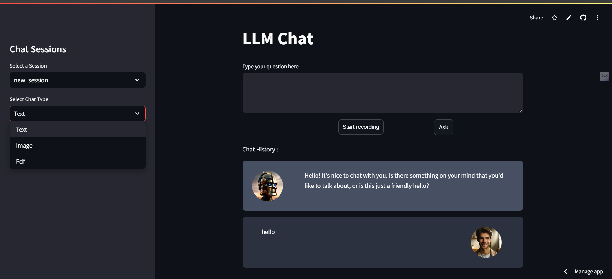
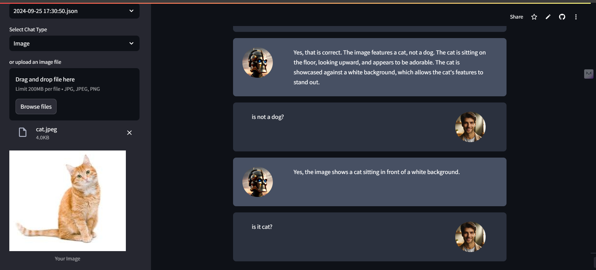
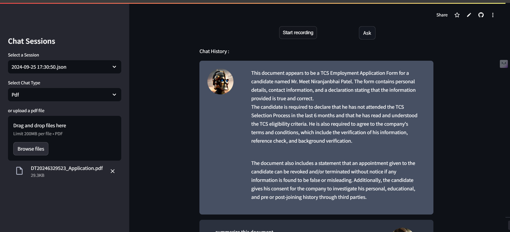

<h5>Conversaional AI Chatbot</h5>

A powerful multimodal conversational chatbot capable of interacting with text, audio, images, and PDFs. Built using advanced AI frameworks, this chatbot combines state-of-the-art language models and data retrieval techniques to deliver seamless and intelligent interactions.

<h3>Features</h3>

Inputs: Supports text, audio, image, and PDF inputs.
Responses: Utilizes Llama 3.1 for accurate and contextual replies.
Document Interaction: Handles PDF data using FAISS vector database for retrieval-augmented generation (RAG).
Session Management: Includes a local database to manage chat sessions.
Streamlined Deployment: Deployed on Streamlit Cloud for ease of access with a responsive user interface.

<h3>Tech Stack</h3>
Frontend: Streamlit
Backend: FAISS, llama3, all-MiniLM, sqlite3, Langchain
Language Model: Llama 3.2 11b vision, 
Version Control: Git, GitHub
 
 
[Live Demo](https://example.com/demo](https://chat-all-mit-patel.streamlit.app/) 
 
<h3> Snapshots </h3>
1. Text Input

2. Image Input

3. PDF Input

<h3>How It Works</h3>

Input Handling: Accepts inputs in various formats (text, audio, images, PDFs).

Processing:
Text/audio inputs processed by the Llama 3.1 model.
Images analyzed using vision-based AI models.
PDF data queried using FAISS for efficient retrieval.

Output Generation: Provides intelligent and context-aware responses.

Deployment: Accessible via a user-friendly Streamlit interface.
